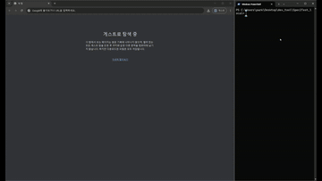

# 🧪 Spec2Test

> **Turn game design docs into QA test cases — local LLM based, containerized with Spring Boot + PostgreSQL + Docker.**

[]()
[]()
[]()
[]()
[]()
[-black?logo=ollama)](https://ollama.com)
[]()

**[🇰🇷 한국어 README](README.md)**

Spec2Test reads a game design document PDF, understands every page with a local vision model, and generates a complete, style-consistent **test case CSV** plus a **list of spec ambiguities** for your designers. The default LLM is Ollama — no API keys, no token bills — and it can be switched to OpenAI/Anthropic purely by configuration.

### 🎬 Demo Video

시연영상 : https://youtu.be/bJy3O2Tp34M


> The demo predates the Spring Boot rewrite (it shows the earlier Python/Flask version), but the core pipeline procedure (Phase 0/1/2) and output format are unchanged.

---

## 💡 Why a local LLM?

- **API incidents shouldn't block your work.** If your automation depends on an external LLM API, their outage becomes your blocker. If your PC (or an internal GPU box) is on, it works.
- **Token bills don't recur.** Analyzing one spec means hundreds of LLM calls. On Ollama, run #100 costs the same as run #1: $0.
- **Some specs must never leave the building.** NDA work, internal networks, and pre-release content all make a local pipeline a requirement, not a preference.

---

## ✨ Key Features

- 🖼️ **Understands slide-based specs** — renders PDF pages and captions them with a local vision model (`qwen2.5vl`).
- 📋 **Style-consistent output** — learns abbreviations, sentence patterns, and category structure from your reference TC CSV.
- 🔎 **Reference-TC RAG** — indexes every row in the reference CSV and retrieves only similar cases for each spec section. Reference cases never override the current spec.
- ❓ **Ambiguity detection** — underspecified content becomes a sourced question list instead of a hallucinated test case.
- ✅ **Self-validating loop** — a rule-based validator checks every section; failures are fed back to the model for retries.
- 🌐 **Web UI with live logs** — a React frontend streams progress over SSE and shows results in a filterable table.
- 🗄️ **Persisted to PostgreSQL** — uploads, per-page captions, sections, generated TCs/questions, coverage reports, and run logs are all stored in the database. Run history is kept automatically.
- 🔁 **Resumable from DB state** — every step skips work that's already done, so Stop/Resume or a process restart continues exactly where it left off.
- 🔌 **Swappable LLM provider** — defaults to Ollama; switch to OpenAI/Anthropic via configuration alone.

---

## ⚙️ How it works

```
PDF upload ──► Phase 0: render pages ─► vision captions ─► section inventory + style guide
                  │
                  ▼
           Phase 1: per section — generate TCs + questions ─► validate (≤3 retries)
                  │
                  ▼
           Phase 2: merge CSV ─► merge questions ─► final validation + coverage report ─► DONE
                  │
                  ▼
     Everything persisted in PostgreSQL (test_case / question / document tables, etc.)
     → downloaded as CSV/MD from the React UI
```

The control flow lives in the Spring Boot backend (`PipelineService` + `pipeline/steps/*`); the LLM (a Spring AI `ChatModel`) is only invoked for well-scoped generation tasks — the same deliberate design as before: 30B-class local models are excellent generators but unreliable long-horizon planners.

Architecture diagrams live in [`docs/`](docs/).

---

## 🚀 Quick Start (Docker)

### Prerequisites

1. **[Ollama](https://ollama.com)** installed and running on the host (`ollama serve`).
2. Pull the three models:
   ```bash
   ollama pull qwen3-coder:30b    # text: sectioning, TC generation, merge review
   ollama pull qwen2.5vl:32b      # vision: slide captioning
   ollama pull nomic-embed-text   # semantic retrieval for reference-TC RAG
   ```
3. **Docker Desktop** installed.

### Run

```bash
cp .env.example .env
docker compose up -d --build
```

Open **http://localhost:8080**, upload your design doc PDF (required) and a reference TC CSV (optional — omit to reuse the last one), then hit **분석 시작 (Start Analysis)**. Ollama runs on the host; the app container reaches it via `host.docker.internal:11434`.

### Local development (without containers)

```bash
docker compose up -d db                     # Postgres only
cd backend && ./mvnw spring-boot:run         # backend on :8080
cd frontend && npm install && npm run dev    # frontend on :5173, /api proxied to :8080
```

---

## 📄 What you get (stored in the DB, downloadable from the UI)

| Table / document | What it is |
|---|---|
| `test_case` | Merged, globally renumbered, validation-passing test cases (downloaded as `TC_<spec>.csv`, UTF-8 BOM) |
| `document(MERGED_QUESTIONS)` | Deduplicated list of spec ambiguities (downloaded as `의문점_<spec>.md`) |
| `document(COVERAGE_REPORT)` | LLM self-audit against the RULES checklist |
| `page.vision_caption` | Raw per-page vision captions — review these for art/UI TC accuracy |
| `log_line` | Full run log (streamed live over SSE, resumable across page refreshes) |

---

## 🗂️ Project structure

```
Spec2Test_local/
├── backend/                    # Spring Boot (Java 17, Spring AI, PostgreSQL/JPA/Flyway)
│   └── src/main/
│       ├── java/com/spec2test/
│       │   ├── api/            # REST controllers (upload/status/stop/resume/logs/outputs)
│       │   ├── domain/ repo/   # JPA entities & repositories
│       │   ├── pipeline/       # PipelineService orchestrator + steps/*
│       │   ├── llm/            # Spring AI ChatModel wrapper (LlmGateway), prompt loader
│       │   ├── csv/            # TC validator & CSV writer
│       │   └── logging/        # DB-backed logs + SSE fan-out
│       └── resources/
│           ├── db/migration/   # Flyway schema
│           └── prompts/        # Prompt templates + runtime copy of RULES.md
├── frontend/                    # React + Vite + TypeScript
├── Dockerfile                   # Multi-stage build (node → maven → JRE)
├── docker-compose.yml            # app + postgres (Ollama runs on the host)
├── PROMPT.md / RULES.md          # Procedure & TC writing rules (single source of truth)
├── docs/                         # Architecture diagrams
└── image/                        # README assets
```

---

## 🔧 Configuration

Controlled via `docker-compose.yml` / `.env` (see `.env.example`):

| Variable | Default | Meaning |
|---|---|---|
| `SPEC2TEST_LLM_PROVIDER` | `ollama` | `ollama` \| `openai` \| `anthropic` |
| `SPEC2TEST_TEXT_MODEL` | `qwen3-coder:30b` | Sectioning, TC/question generation, merge review |
| `SPEC2TEST_VISION_MODEL` | `qwen2.5vl:32b` | Per-page slide captioning |
| `SPEC2TEST_EMBEDDING_MODEL` | `nomic-embed-text` | Ollama embedding model for semantic RAG retrieval |
| `SPEC2TEST_EMBEDDING_PROVIDER` | `ollama` | Embedding provider for RAG; configured independently of the chat provider |
| `SPEC2TEST_RAG_TOP_K` | `6` | Number of similar reference TCs injected per section |
| `OLLAMA_BASE_URL` | `http://host.docker.internal:11434` | Ollama endpoint |
| `OPENAI_API_KEY` / `ANTHROPIC_API_KEY` | (empty) | Only needed when using a cloud provider |

Context length, timeouts, and retry counts are tunable under `spec2test.llm.*` in `backend/src/main/resources/application.yml`.

---

## ⚠️ Known limitations

- 30B-class local models trail frontier APIs on long-document judgment and subtle ambiguity classification — output is designed for **human review**, and the coverage report tells you where to look first.
- Vision caption quality drives art/UI TC accuracy. Review `page.vision_caption` rows.
- Stop is cooperative cancellation — it may take until the current in-flight LLM call finishes.
